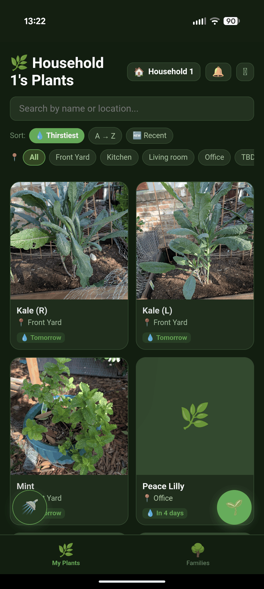
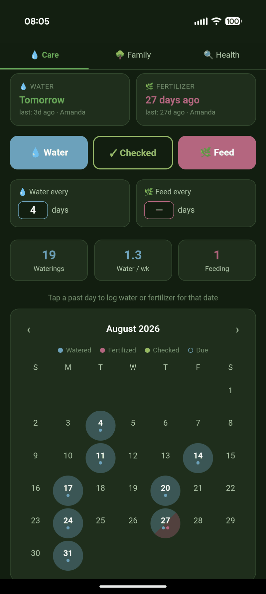
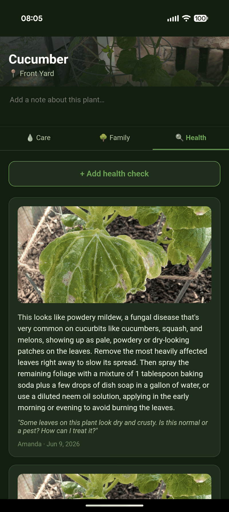
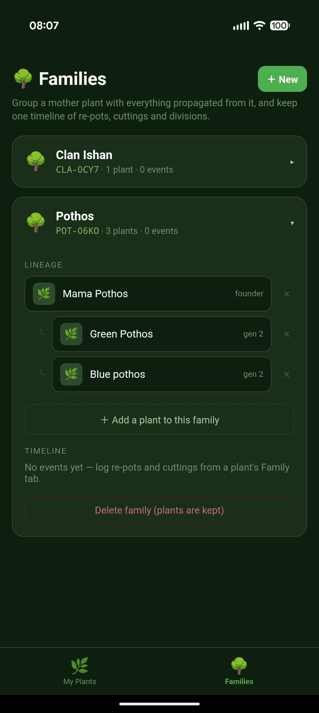
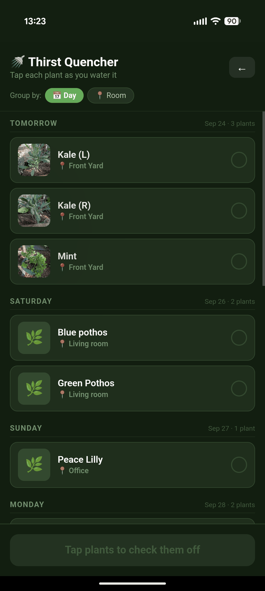

# Thirst Trap 🚿

An app so our household can track everything we want to know about our plants — watering,
fertilizing, health and propagation — in one place.

Built with Claude Code. The product decisions and testing are mine.

**Live app:** running in production for our house. [Get in touch](https://github.com/long-amy)
if you'd like a link — happy to share, I just like knowing who's using it.

---

## Why

My husband had tried a handful of different plant apps. Each one satisfied a different need,
but he wanted something that had it all. That's where Claude and I came in.

Now that I'm building it, he files feature requests.

---

## Screenshots

<table>
  <tr>
    <td align="center"><br/><sub>Home</sub></td>
    <td align="center"><br/><sub>Water and fertilizer on one calendar</sub></td>
    <td align="center"><br/><sub>Health check</sub></td>
  </tr>
  <tr>
    <td align="center"><br/><sub>Propagation lineage</sub></td>
    <td align="center"><br/><sub>A watering round, grouped by day</sub></td>
    <td></td>
  </tr>
</table>

---

## Features

**Shared household**
- Google Sign-In; create a household or join one with a 6-character invite code
- Real-time sync — a log by one person appears on the other's phone immediately
- Every log records who did it and when

**Care tracking**
- One combined calendar for watering *and* fertilizing — blue for water, pink for feed, olive for a check. Days with both get a split background plus a dot per kind
- Per-plant intervals ("thirsty every 7 days") with projection dots for the predicted next due date
- Back-date any entry by tapping a past day
- **Checked** as a first-class action, distinct from watering — "I looked, it's still damp" pushes the schedule without falsely recording a watering
- Batch logging: long-press to multi-select, then water/check/feed a whole shelf at once

**Thirst Quencher**
- A checklist view for a watering round, with sound and haptics as you tick plants off
- Group **by day** (Overdue / Today / Tomorrow / weekday, with everything past a week collapsed into Later) or **by room**
- Within a day, plants sort by room so you're not criss-crossing the house

**Plant families**
- Group a mother plant with everything propagated from it, via `familyId` + `parentPlantId`
- Shared lineage timeline: re-potted, took a cutting, propagated, rooted, potted up, divided, pruned
- Logging a cutting can create the child plant in one write, already parented
- Top-level Families screen showing the lineage tree, plus a per-plant Family tab

**Archiving**
- Archive with a reason (re-potted, propagated, given away, sold, died, other) and an optional note
- Archived plants leave the grid, the Thirst Quencher and the reminder notifications, but keep every log, photo and family event
- Reversible at any time

**Other**
- AI health analysis — upload a photo, get a diagnosis from Claude
- Daily push reminders via a scheduled Cloud Function, at your chosen time and timezone
- Installable PWA with a working Android back gesture
- Freeform per-plant notes, location filter, search

---

## Tech Stack

| Layer | Technology |
|---|---|
| Front end | React 19, Vite |
| Database | Firebase Firestore (real-time) |
| Auth | Firebase Authentication (Google) |
| File storage | Firebase Storage |
| Serverless | Cloud Functions v2 (Node 22) — scheduled reminders, Claude proxy |
| Secrets | Google Secret Manager |
| Hosting | Firebase Hosting |
| AI | Anthropic Claude API (`claude-opus-5`), server-side |
| Push | Firebase Cloud Messaging |
| Dates | date-fns |
| PWA | Web App Manifest |

---

## Project Structure

```
firestore.rules              # household-scoped Firestore rules
storage.rules                # household-scoped Storage rules
test/
└── rules.test.mjs           # 23 emulator tests for the rules above
functions/
└── index.js                 # scheduled reminders + Claude proxy (callable)
src/
├── components/
│   ├── AddPlantModal.jsx
│   ├── ArchivePlantModal.jsx
│   ├── BottomNav.jsx
│   ├── CareCalendar.jsx     # combined water + fertilizer calendar
│   ├── CareTab.jsx          # watering & fertilizing actions, intervals, stats
│   ├── EditPlantModal.jsx
│   ├── FamilyTab.jsx        # per-plant lineage + event log
│   ├── HealthTab.jsx
│   ├── HouseholdModal.jsx
│   ├── NotificationSettings.jsx
│   └── ThirstQuencher.jsx   # watering-round checklist
├── hooks/
│   ├── useAuth.js
│   └── useBackGuard.js      # Android back gesture handling
├── lib/
│   ├── anthropic.js         # thin wrapper over the callable function
│   ├── archive.js
│   ├── dates.js             # single source of truth for care-schedule math
│   ├── families.js          # lineage model + event types
│   ├── firebase.js
│   └── sounds.js
└── screens/
    ├── FamiliesScreen.jsx
    ├── HomeScreen.jsx
    ├── HouseholdSetupScreen.jsx
    ├── LoginScreen.jsx
    └── PlantDetailScreen.jsx
```

---

## Notes

- All plant and log data is scoped to a `householdId`; Firestore and Storage rules enforce that scope, covered by emulator tests in [`test/rules.test.mjs`](test/rules.test.mjs)
- Households are capped at 2 members, enforced in the security rules rather than only in the UI

---

## License

© 2026 Amy Long. All rights reserved.

This code is published to be read, not reused. You're welcome to look through it,
but it isn't licensed for copying, modification or redistribution.
